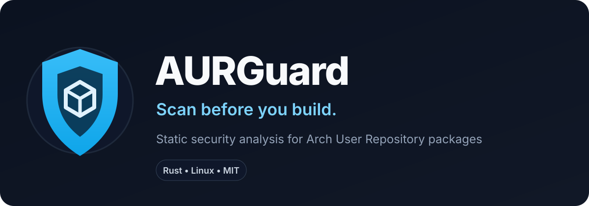

<p align="center">
  
</p>

<p align="center">
  <a href="https://github.com/M3rsy/aurguard/actions/workflows/ci.yml"></a>
  <a href="https://github.com/M3rsy/aurguard/releases"></a>
  <a href="LICENSE"></a>
  
  
</p>

<p align="center">
  <strong>A defensive static-analysis CLI for Arch User Repository packages.</strong><br>
  Inspect first. Build second. Trust nothing blindly.
</p>

<p align="center">
  <a href="#-quick-start">Quick start</a> •
  <a href="#-what-it-detects">Detections</a> •
  <a href="#-architecture">Architecture</a> •
  <a href="#-roadmap">Roadmap</a> •
  <a href="#-contributing">Contributing</a>
</p>

> [!IMPORTANT]
> **AURGuard never sources or executes a `PKGBUILD` while scanning it.** Package metadata is treated as hostile input, not trusted shell code.

> [!WARNING]
> A **LOW** risk result is not proof that a package is safe. AURGuard is an additional review layer, not a replacement for manual inspection, signatures, upstream verification, or endpoint security.

---

## 🛡️ Why AURGuard?

The AUR is one of the best parts of the Arch ecosystem, but its security model expects users to review build recipes before executing them.

AURGuard makes suspicious package behavior **loud, explainable and automatable** before `makepkg` gets a chance to run anything.

Instead of only asking whether a file matches a known signature, AURGuard asks:

> **What is this package trying to do, where did the signal come from, and why should I care?**

```text
Untrusted AUR repository
          │
          ▼
   static inspection
          │
   ┌──────┼─────────┐
   ▼      ▼         ▼
 shell   files    integrity
 rules   / ELF    signals
   └──────┼─────────┘
          ▼
   evidence + score
          │
          ▼
LOW / MEDIUM / HIGH / CRITICAL
```

Every finding includes a stable rule ID, severity, location, evidence and score contribution.

---

## ⚡ Quick start

### Arch Linux / CachyOS / EndeavourOS

```bash
sudo pacman -S --needed base-devel rust git

git clone https://github.com/M3rsy/aurguard.git
cd aurguard
cargo build --release
```

Then scan an AUR package:

```bash
./target/release/aurguard scan zen-browser-bin
```

Or a local package repository:

```bash
./target/release/aurguard scan ./my-package
```

JSON output:

```bash
./target/release/aurguard scan ./my-package --format json
```

CI threshold:

```bash
./target/release/aurguard scan ./my-package --fail-on high
```

### Exit codes

| Code | Meaning |
|---:|---|
| `0` | Scan completed and configured threshold was not reached |
| `1` | Operational error |
| `2` | `--fail-on` threshold was reached |

---

## 🚨 Example report

```text
AURGuard 0.1.0
Static AUR package security report

Package:            suspicious-package
Files scanned:      7
Text files scanned: 5
ELF files found:    1

Risk:  CRITICAL  (100/100)
----------------------------------------
[CRITICAL] SHELL001  Remote content passed directly to a shell
Location: PKGBUILD:18
Weight: +100

[HIGH] FILE001  ELF binary stored in AUR repository
Location: validator
Weight: +70
```

The goal is not to print a scary red badge. The goal is to make the decision **reviewable by a human**.

---

## 🔍 What it detects

AURGuard v0.1.0 currently evaluates signals such as:

| Signal | Typical severity |
|---|---:|
| Remote content executed directly by a shell | 🔴 Critical |
| Bundled ELF inside the AUR Git repository | 🟠 High |
| Privilege escalation in build metadata | 🟠 High |
| Dynamic shell evaluation | 🟠 High |
| Low-level networking utilities | 🟠 High |
| Encoded / obfuscated-looking data | 🟡 Medium+ |
| Relative executable launches | 🟡 Medium+ |
| Sensitive credential paths | 🟠 High |
| Sensitive system / process-injection paths | 🟠 High |
| systemd / cron / udev persistence locations | 🟡 / 🟠 |
| Disabled checksum verification | 🟡 Medium |
| Plain HTTP sources | 🟡 Medium |
| Repository symlinks | 🟢 / 🟡 review |

### Rule families

- `SHELLxxx` — shell execution and privilege behavior
- `NETxxx` — networking behavior
- `PKGxxx` — package metadata and integrity
- `SRCxxx` — source transport / provenance signals
- `OBFxxx` — possible obfuscation
- `FILExxx` — bundled files and binaries
- `PERSISTxxx` — startup / persistence locations

---

## 🎯 Risk model

AURGuard reports **risk**, not “safe / infected”.

| Score | Result |
|---:|---|
| `0–19` | 🟢 **LOW** |
| `20–49` | 🟡 **MEDIUM** |
| `50–79` | 🟠 **HIGH** |
| `80–100` | 🔴 **CRITICAL** |

An explicit critical detection forces the final result to `CRITICAL`.

---

## 🧠 Architecture

AURGuard is a Rust Cargo workspace split into a reusable engine and a thin CLI:

```text
aurguard/
├── crates/
│   ├── aurguard-core/        # detection engine
│   │   ├── scanner
│   │   ├── rules
│   │   └── risk model
│   │
│   └── aurguard-cli/         # CLI + hardened AUR cloning
│
├── docs/
├── packaging/
├── tests/
└── .github/workflows/
```

The split is intentional. Future interfaces can reuse `aurguard-core` without duplicating security logic:

```text
                 aurguard-core
                      │
      ┌───────────────┼────────────────┐
      ▼               ▼                ▼
     CLI             TUI              CI
      │
      ├── paru / yay integration
      ├── sandbox builder
      └── future GUI
```

### Scanner security properties

AURGuard's static path follows several non-negotiable rules:

1. Never execute untrusted package metadata during a scan.
2. Never source a `PKGBUILD`.
3. Invoke Git directly rather than interpolating package names through a shell.
4. Disable global/system Git configuration for AUR clone operations.
5. Disable Git hooks and local-file protocol during hardened clones.
6. Treat filenames and terminal evidence as hostile input.
7. Escape terminal control characters before rendering findings.
8. Prefer deterministic, explainable detections for blocking decisions.
9. Never present low risk as proof of safety.
10. Keep future dynamic analysis inside an isolated sandbox.

---

## 🗺️ Roadmap

### v0.1 — Static Guardian ✅

- [x] Hardened AUR clone
- [x] Local repository scan
- [x] Suspicious shell-pattern detection
- [x] ELF discovery + SHA-256 fingerprint
- [x] Integrity / source signals
- [x] Risk scoring
- [x] Terminal + JSON reports
- [x] CI threshold support

### v0.2 — Git Guardian 🚧

- [ ] Bash AST analysis with `tree-sitter-bash`
- [ ] `aurguard diff <package>`
- [ ] Commit-to-commit comparison
- [ ] Newly introduced executable detection
- [ ] Source URL change detection
- [ ] Maintainer / adoption-change signals

### v0.3 — Binary Intelligence

- [ ] ELF headers, imports, symbols and strings
- [ ] Suspicious capability correlation
- [ ] YARA-X rules
- [ ] Source provenance scoring
- [ ] Optional threat-intelligence adapters

### v0.4 — Sandbox Build

- [ ] Bubblewrap / namespace isolation
- [ ] Empty synthetic `$HOME`
- [ ] Restricted filesystem exposure
- [ ] Network-disabled build phase
- [ ] Runtime behavior report

### v1.0 — AUR Security Gateway

```bash
aurguard scan <package>
aurguard diff <package>
aurguard build <package>
aurguard install <package>
aurguard audit
```

Planned ecosystem work includes `paru`/`yay` workflows, signed release artifacts, an official AUR package and community rule packs.

---

## 🐧 Target platforms

Primary targets:

- Arch Linux
- CachyOS
- EndeavourOS
- Garuda Linux
- Manjaro

The static scanner is designed to remain useful on other Linux distributions for CI and development where practical.

---

## 🧪 Development

```bash
cargo fmt --all -- --check
cargo clippy --workspace --all-targets -- -D warnings
cargo test --workspace
```

Build release binary:

```bash
cargo build --release -p aurguard
```

---

## 🤝 Contributing

AURGuard is young, which means security-minded contributors can still shape its foundations.

Useful contributions include deterministic rules, false-positive fixtures, Bash AST analysis, ELF inspection, sandbox design review, Arch packaging expertise and documentation.

If you discover a security issue in AURGuard itself, please report it responsibly rather than publishing an exploit first.

---

## ⭐ If AURGuard saves you one sketchy `makepkg`...

Give the project a star. It helps other Arch users discover it and signals that the work is worth continuing.

**Scan first. Build second. Trust nothing blindly.**

---

## 📄 License

AURGuard is released under the [MIT License](LICENSE).

Created by [@M3rsy](https://github.com/M3rsy) and the AURGuard contributors.
